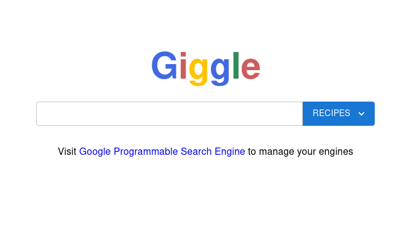
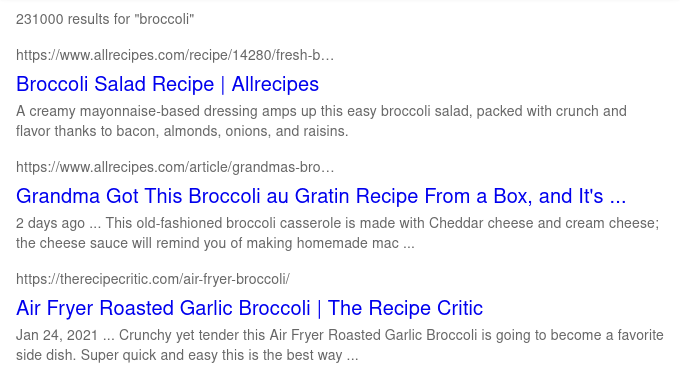
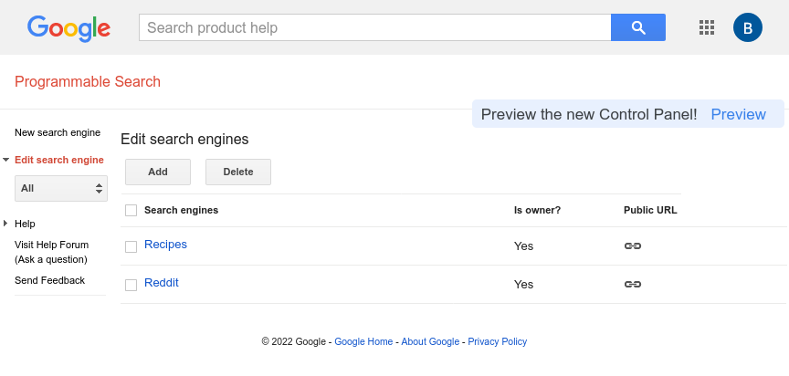

# Giggle

A self-hosted, customizable and ad-free Google Search experience.

## What does it do?

Giggle lets you run Google searches against allow- and block-lists in an easy way. You create lists of sites to include or exclude in Google's [Programmable Search Engine service](https://developers.google.com/custom-search) and Giggle will pick them up for use.

## How it works

After installation, Giggle logs into Google for you to gather a list of your [Custom Search Engines](https://programmablesearchengine.google.com/about/). When you perform a search, you select the engine to use from a dropdown and Giggle uses your [Developer API key](https://console.cloud.google.com/apis/dashboard) to execute a search against it. Everything is self-hosted so your credentials and data belong to _you_.

## How it looks

Here's a glimpse of the homepage, it may look familiar 🙂



Your results contain no ads and are restricted to the sites you configure in the [Programmable Search Engine console](https://programmablesearchengine.google.com/smart_sign_in).



# Getting Started

Giggle is self-hosted meaning you may host it any way you like or just run it locally. It uses [NextJS](https://nextjs.org/) so development and deployments are _super_ easy.

## What you'll need

- Some technical knowledge - I'll walk you through it in this README. If you don't already have them, you'll need [NodeJS](https://nodejs.org/) and [yarn package manager](https://yarnpkg.com/).
- A Google account **without** MFA - You'll need to inject its username and password as environment variables. If you're curious/concerned about how they're used, check out [this file](https://github.com/dan-lovelace/giggle/blob/main/pages/api/engines.ts). Basically, Giggle uses [Puppeteer](https://github.com/puppeteer/puppeteer) to log in to Google in order to retrieve your custom search engine IDs. If you do not have an account without MFA, just go ahead and [make a new one](https://accounts.google.com/signup) - **⚠️ MAKE SURE NOT TO TURN ON MFA! ⚠️**
- A Google Developer API key with **Custom Search API** privileges - Giggle uses your API key to run queries against your search engines to retrieve JSON results without ads. Head over to the [Developer Console](https://console.cloud.google.com/apis/dashboard) to set this up. Each engine gets 100 queries per day for free 💰
- At least one custom search engine configured in the Google account's [Programmable Search Engine console](https://programmablesearchengine.google.com/smart_sign_in) - Your console should look something like this:



## Setup

- Open a new Terminal window
- Clone this repository with `git clone https://github.com/dan-lovelace/giggle.git`
- Change into the new directory with something like `cd giggle`
- Create an empty `.env` file with `touch .env`
- Open the `.env` file and paste in the following template, then update the values with your own:

```sh
GOOGLE_USERNAME=[your_email]
GOOGLE_PASSWORD=[your_password]
GOOGLE_API_KEY=[your_api_key]
```

- Run `yarn` to install dependencies
- Run `yarn build` to create a new build
- Run `yarn start` and wait for it to change to the `ready` state
- Navigate to `http://localhost:3000` in a browser
- If everything went right, you should see the Giggle homepage

## Troubleshooting

- If you made a new Google account, it's possible the first couple login attempts by Giggle will fail due to being prompted to confirm a phone number. Try refreshing the page. You may also check the Puppeteer output in `puppeteer/screenshots` for any insight.
- If you see an error saying something like "No engines found," make sure at least one search engine exists in your [Programmable Search Engine console](https://programmablesearchengine.google.com/smart_sign_in).
- Feel free to open a [GitHub issue](https://github.com/dan-lovelace/giggle/issues) if you need additional help.

# Development

Run `yarn dev` to get started using the dev server.

**Note**: `yarn dev` starts a local instance _without_ API caching which may run up your search request limits rather quickly. There is some mock implementation in [/pages/api/search.ts](https://github.com/dan-lovelace/giggle/blob/main/pages/api/search.ts) which will avoid hitting your engine's API during development. Uncomment the `MOCK USAGE` section and comment the `REAL USAGE` to use it. Mocking the search API uses the JSON located in [mocks/results-recipes.json](https://github.com/dan-lovelace/giggle/blob/main/mocks/results-recipes.json).

## Testing

Giggle's tests are written using [Cypress](https://www.cypress.io/) and can be run with either of these commands:

- `yarn cypress:open` - Opens a Cypress runner for testing individual spec files.
- `yarn cypress:run` - Executes all tests in series.

## Contribution

If you'd like to contribute, feel free to [open a PR](https://github.com/dan-lovelace/giggle/compare) any time. Please abide by these guidelines:

- Add new tests as necessary
- Make sure the tests pass with `yarn cypress:run`
- Include a description about the changes and why you think they're necessary

# What's Next?

I'd like to build some sort of [annotation](https://developers.google.com/custom-search/docs/basics) management system to avoid having to manually create/update individual engines in the web console. It would be reduced to creating a single engine and Giggle would swap out annotation files on-the-fly. It would be much more ideal since you'd never need to visit Google's console again but it could turn out to be painfully slow. Let me know in [GitHub issues](https://github.com/dan-lovelace/giggle/issues) if this interests you.

Also in the cards could be a fully-managed service including hosting. Users would need to hand over their own Google login credentials and API key which I can understand being hesitant about. If that's something you're interested in, please open a [GitHub issue](https://github.com/dan-lovelace/giggle/issues) and start the conversation.

The mobile experience could be better.
