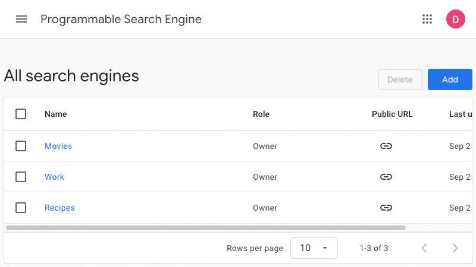
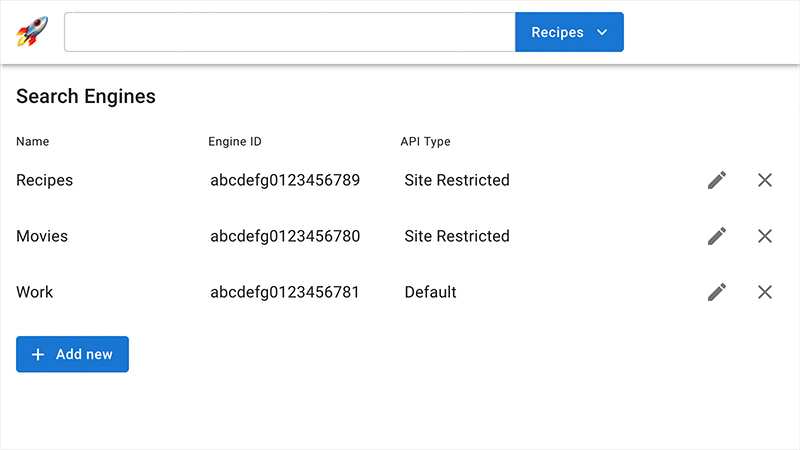
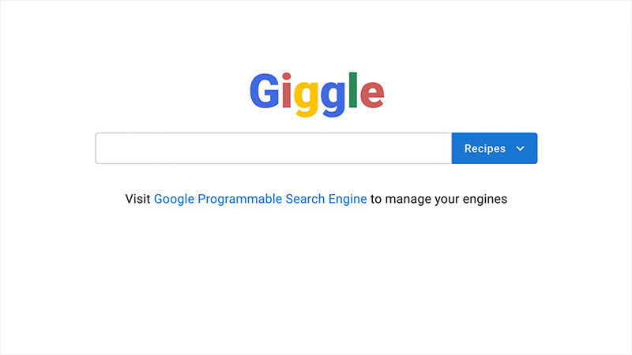
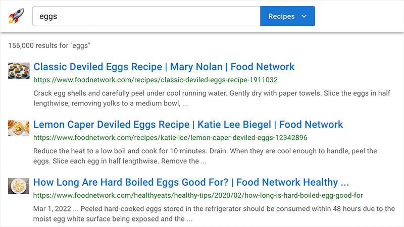
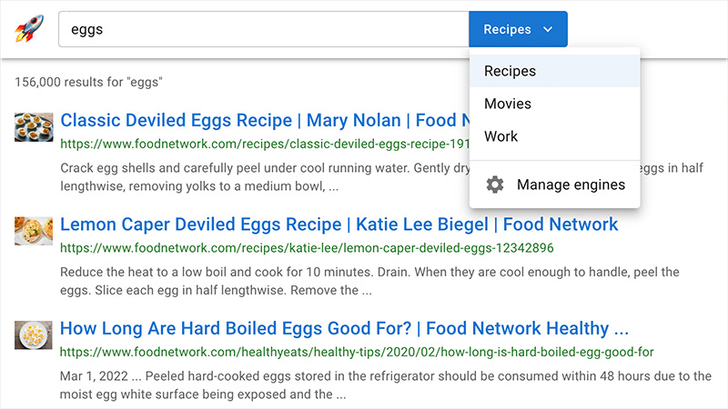

# Giggle

A self-hosted, customizable and ad-free Google Search experience.

## Table of contents

1. [Introduction](#introduction)
   - [How it works](#how-it-works)
   - [How it looks](#how-it-looks)
2. [Getting started](#getting-started)
   - [What you'll need](#what-youll-need)
   - [Initialize project](#initialize-project)
   - [Add Developer API key](#add-developer-api-key)
   - [Further reading](#further-reading)
3. [Development](#development)
   - [Start server](#start-server)
   - [Optional configuration](#optional-configuration)
     - [Environment variables](#environment-variables)
     - [Databases](#databases)
   - [Testing](#testing)
4. [Building & deployment](#building--deployment)

# Introduction

Giggle lets you run Google searches against allow- and block-lists in an easy
way. You create lists of sites to include or exclude in Google's
[Programmable Search Engine service](https://developers.google.com/custom-search)
and Giggle provides an interface for them.

## How it works

Giggle works by making requests to Google's
[Custom Search JSON API](https://developers.google.com/custom-search/v1/overview)
using your Developer API key. After creating one or more Programmable Search
Engines in the
[Google console](https://programmablesearchengine.google.com/controlpanel/all),
you'll add them to Giggle using the engine manager.

| 1. Google console                        |     | 2. Giggle engine manager                       |
| ---------------------------------------- | --- | ---------------------------------------------- |
|  | ➡️  |  |

Different engines may be selected when searching so you can easily switch
between them. Giggle also offers the option to use the
[Site Restricted JSON API](https://developers.google.com/custom-search/v1/site_restricted_api)
which offers unlimited free searches. Be sure to read the
[JSON API guide](https://developers.google.com/custom-search/v1/overview) so you
know what to expect around usage and pricing. If you cannot use the Site
Restricted API, you still get 100 searches per day for free.

## How it looks

| Homepage                           | Search results                                 |
| ---------------------------------- | ---------------------------------------------- |
|  |  |

| Engine manager                                 | Engine selector                                  |
| ---------------------------------------------- | ------------------------------------------------ |
|  |  |

# Getting started

Giggle is self-hosted meaning you may host it any way you like or just run it
locally. It uses [Next.js](https://nextjs.org/) so development and deployment
are _super_ easy.

## What you'll need

- Some technical knowledge - I'll walk you through it in this guide. If you
  don't already have them, you'll need
  [NodeJS v18](https://nodejs.org/en/download) or higher and
  [yarn package manager](https://yarnpkg.com/).
- A Google Developer API key with **Custom Search API** privileges - You can do
  this directly on the
  [Programmable Search Engine](https://developers.google.com/custom-search/v1/overview)
  overview page or manually on your
  [Google Cloud credentials page](https://console.cloud.google.com/apis/credentials).
- At least one custom search engine configured in the Google account's
  [Programmable Search Engine console](https://programmablesearchengine.google.com/smart_sign_in) -
  Your console should look something like this:<br /><br />
  

## Initialize project

From a terminal window, run the following commands:

```sh
$ git clone https://github.com/dan-lovelace/giggle.git
$ cd giggle
$ yarn initialize
```

<details>
  <summary>
    <h4 style="display: inline;">Command breakdown</h4>
  </summary>

1.  Clone this repository to your current directory

    ```sh
    git clone https://github.com/dan-lovelace/giggle.git
    ```

2.  Change into the newly-created directory

    ```sh
    cd giggle
    ```

3.  Initialize the project

    ```sh
    yarn initialize
    ```

    Initialization does a number of things behind the scenes to get your project
    in a usable state:

    - Installs Node dependencies
    - Creates a SQLite database and runs migrations to define its schema
    - Creates an environment file where you'll add your Developer API key and
      any other configurations

    </details>

## Add Developer API key

The initilization script creates a `.env` file in your app package directory:
[packages/app/.env](packages/app/.env). Copy your Developer API key and paste it
into the `.env` file in the right place. The final version should look something
like this:

```
GOOGLE_API_KEY=ABCdef123_gG-aBcDeF123aBcDeF123
```

## Further reading

- [Next.js docs](https://nextjs.org/docs) - Contains lots of good information
  about configuration and deployment.

# Development

## Start server

After following the [Getting started](#getting-started) steps, run the following
command to start the development server:

```sh
yarn dev
```

**Note**: This will start a local instance _without_ API caching which may run
up your search request limits rather quickly if you aren't using the
[Site Restricted](https://developers.google.com/custom-search/v1/site_restricted_api)
JSON API. There is a `MOCK=true` environment variable you may set in your
[packages/app/.env](packages/app/.env) that will return mocked search results
when searching instead of hitting the Google API.

## Optional configuration

### Environment variables

A number of environment variables are available to configure the application:

| Variable                       | Type    | Default       | Description                              |
| ------------------------------ | ------- | ------------- | ---------------------------------------- |
| `MOCK`                         | boolean | `false`       | Whether search result mocking is enabled |
| `NODE_ENV`                     | string  | `development` | The target environment                   |
| `RESULTS_CACHE_LENGTH_SECONDS` | string  | `3600`        | How long to cache search results         |

### Databases

If you choose to deploy your application to a real server, you'll need to
configure a database other than the one that was automatically created during
project initialization. Giggle uses [Knex.js](https://knexjs.org/) to manage
database connections and migrations. Open the file
[packages/db/knexfile.ts](packages/db/knexfile.ts) to edit configuration for
your desired environment. You should set a `NODE_ENV` environment variable to
target a specific environment; Giggle will use `development` by default.

## Testing

Tests are written using [Cypress](https://www.cypress.io/) and can be run with
either of these commands:

- `yarn workspace @giggle/app cypress:open` - Opens a Cypress runner for testing
  individual spec files.
- `yarn workspace @giggle/app cypress:run` - Executes all tests in series.

# Building & deployment

The following commands will build your project and start it:

```sh
$ yarn build
$ yarn start
```

Read the Next.js
[Deploying guide](https://nextjs.org/docs/app/building-your-application/deploying)
for deployment options.
